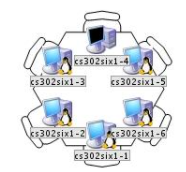
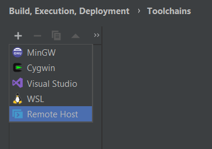
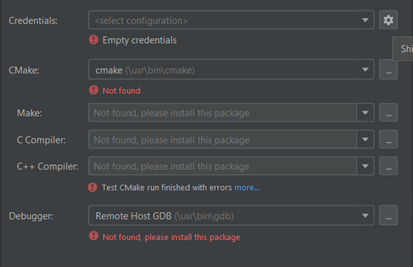
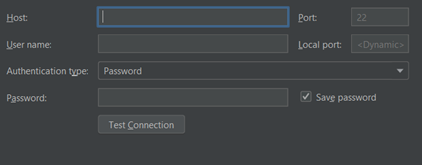
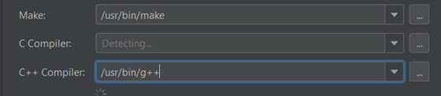

# Remote-Host-Clion
Read to understand how to connect to lab computers in Ben Gurion University Through CLion

1.	Choose requested computer in the lab from here: http://oldweb.cs.bgu.ac.il/facilities/labs.html

2.	Go to CLion. 
3.	In Settings, go to “Build, Execution, Deployment”. 
4.	Go to “toolchains”
5.	Click the “+” sign, and choose “remote host”.

6.	In credentials, click on the wheel.

7.	Click on the “+” sign.

8.	Put the computer address in “host”, [computer_name].bgu.ac.il

9.	Put your Linux username and password.

10.	Press “test connection”.
Make sure you have VPN turned on (as explained here https://www.cs.bgu.ac.il/~spl211/PracticalSession01/Linux)

11.	Once you are connected, fill “Make” and “C++ Compiler” in the following manner.

12.	That is it.

Note:
Perhaps you will have to make some preparations first. You should connect to the computer with putty/ mobaXterm/ any shell you like, and install c++ compiler using the following link:
https://linuxconfig.org/how-to-install-g-the-c-compiler-on-ubuntu-18-04-bionic-beaver-linux
